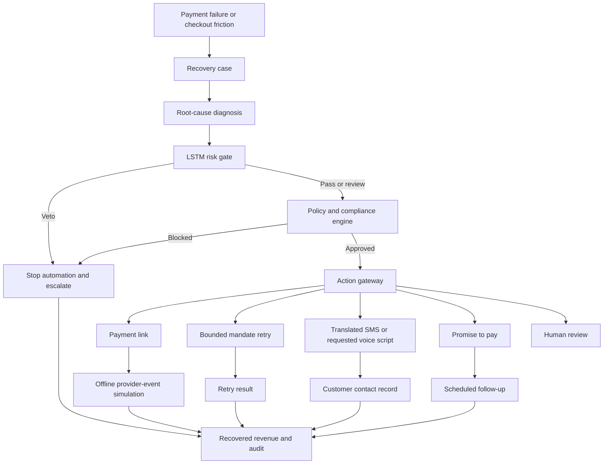
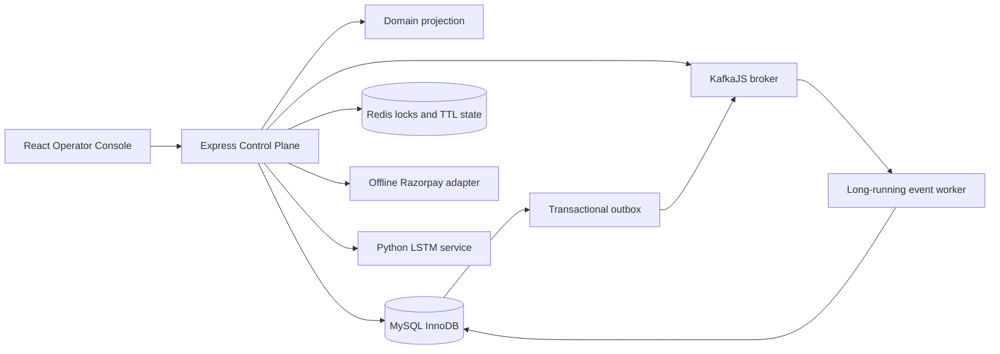

# RevRakshak

## Revenue Recovery Control Plane

RevRakshak is a Track 3 revenue-recovery application for merchants. It identifies payment friction, explains the likely cause, estimates recovery opportunities, applies deterministic safety rules, selects a bounded recovery action, and records the result for operators.

The financial problem is simple: a payment failure is not always permanent revenue loss. RevRakshak helps a merchant distinguish recoverable friction from unsafe or uneconomic retries, then guides the next action without blindly chasing the customer.

This project uses synthetic/demo payment data and an offline Razorpay adapter.

## What It Demonstrates

- Revenue at risk and recovery opportunities
- Payment degradation, checkout drop-off, failed-subscription, and receivables cases
- LSTM-style anomaly/risk gating with rule fallback
- Deterministic policy and compliance checks
- Consent, contact-hour, amount, and contact-frequency limits
- Payment-link request generation
- Bounded mandate retry sequencing
- Hinglish translation and user-requested browser voice playback
- Promise-to-pay tracking and human escalation
- MySQL/InnoDB idempotency and executor protection
- Kafka event publishing, consumer groups, retries, and dead-letter topics
- Redis distributed locks and TTL coordination
- Outbox and event replay foundations
- Measured synthetic batch recovery results
- Audit timeline and decision trace

## Business Flow



## Website Flow

1. **Control Tower:** revenue at risk, recovery rate, active cases, exceptions, opportunities, and service health.
2. **Recovery Pipeline:** ingestion, diagnosis, risk gate, action gateway, verification, and audit.
3. **Recovery Queue:** search and filter cases by status, cause, risk, amount, expected value, and anomaly score.
4. **Recovery Detail:** customer context, failure cause, model evidence, compliance checks, action execution, timeline, audit, and voice control.
5. **Customer Intelligence:** payment history, consent, contact history, and historical recovery behavior.
6. **ML Observability:** threshold, feature importance, anomaly evidence, and synthetic evaluation metrics.
7. **Simulator:** compare payment-link, voice, discount, human, and passive-retry strategies.
8. **Promises:** track active, due, kept, broken, and expired commitments.
9. **Policy Center:** edit merchant thresholds and compile natural-language policy instructions.
10. **Audit:** inspect decisions, actors, policy results, model scores, and outcomes.
11. **System Health:** view service topology and demonstrate dependency fallbacks.

## Quick Start

```powershell
npm install
npm run dev
```

Open `http://localhost:3000`.

For the distributed WSL setup, configure `.env` with MySQL, Redis, and Kafka, then run:

```powershell
npm run dev
npm run worker
```

Optionally run the local Python LSTM service:

```powershell
npm run lstm:service
```

## Demo Scenarios

Seed one successful payment and one low-risk failed network payment:

```powershell
$seed = Invoke-RestMethod http://127.0.0.1:3000/api/demo/payments/seed -Method Post
$seed.data | ConvertTo-Json -Depth 3
```

Execute the returned failed case:

```powershell
$body = @{ actionType = 'RETRY_SUBSCRIPTION_MANDATE'; reason = 'Track 3 demo retry' } | ConvertTo-Json
Invoke-RestMethod http://127.0.0.1:3000/api/recovery/<FAILED_CASE_ID>/execute -Method Post -ContentType 'application/json' -Body $body
```

Run measured batch recovery:

```powershell
Invoke-RestMethod http://127.0.0.1:3000/api/recovery/batch-run -Method Post
```

The response reports processed cases, recovered amount, recovery rate, vetoes, exceptions, and creates an audit entry.

Translate a message:

```powershell
$body = @{ text = 'Payment failed. Please use the secure payment link to try again.'; from = 'en'; to = 'hinglish' } | ConvertTo-Json
Invoke-RestMethod http://127.0.0.1:3000/api/outreach/translate -Method Post -ContentType 'application/json' -Body $body
```

Voice is explicit: open a consented case and click **Speak recovery script**. The browser translates and speaks the message locally; there is no autoplay or background call.

## Architecture



### Safety boundary

- Frontend requests an action; it does not own policy authority.
- Zod validates action, policy, promise, translation, and event DTOs.
- Compliance checks amount, consent, contact frequency, contact hours, channels, and human approval.
- The anomaly gate can veto automation.
- MySQL unique keys protect reservations and executor claims.
- Redis TTL locks protect concurrent workers.
- Each case receives one bounded automated action.
- Kafka failures use retry and dead-letter topics.

## Repository Layout

```text
RevRakshak/
|-- server.ts                         Express + Vite entry point
|-- package.json                       Scripts and dependencies
|-- .env                               Runtime configuration
|-- src/
|   |-- App.tsx                        Frontend view router
|   |-- types.ts                       Shared domain types
|   |-- context/AppContext.tsx         Frontend state and refresh
|   |-- services/api.ts                Browser API client
|   |-- components/                   Shared UI components
|   |-- components/layout/             App shell and navigation
|   |-- views/                        Control Tower and workflow screens
|-- server/
|   |-- routes.ts                     HTTP endpoints
|   |-- data/mockData.ts               Synthetic seed data
|   |-- data/store.ts                 Domain projection and action flow
|   |-- services/compliance.ts         Deterministic compliance checker
|   |-- services/dtos.ts               Zod request schemas
|   |-- services/eventContract.ts      Versioned event envelope and partitions
|   |-- services/infrastructure.ts     Production configuration validation
|   |-- services/kafkaBus.ts           KafkaJS, outbox, replay, retry topics
|   |-- services/lstmClient.ts         Python LSTM client
|   |-- services/mlModel.ts             TypeScript fallback anomaly model
|   |-- services/policyCompiler.ts      Gemini plus deterministic compiler
|   |-- services/razorpayAdapter.ts     Offline Razorpay request builder
|   |-- services/redisStore.ts          Redis locks and local fallback
|   |-- services/sqliteStore.ts         Compatibility filename for MySQL store
|   |-- services/translation.ts         Google Translate integration
|   |-- workers/eventWorker.ts          Long-running event worker
|   |-- failure-injection.ts            Idempotency and locking checks
|-- lstm_autoencoder.py                 Offline LSTM gate and fallback
|-- lstm_service.py                     Local Python HTTP wrapper
|-- db/migrations/                      Forward and rollback SQL references
|-- infra/                              Manual infrastructure notes and configuration
|-- USER_GUIDE.md                       Operational guide
|-- MASTER_FLOW.md                      Full application/code walkthrough
|-- VIDEO_SCRIPT_5_MINUTES.md           Five-minute demo script
```

The filename `server/services/sqliteStore.ts` is retained for import compatibility. It now implements MySQL/InnoDB; no SQLite database file is used.

## API Reference

All routes are mounted under `/api`.

### Dashboard and recovery

```text
GET  /health
GET  /dashboard/summary
GET  /dashboard/opportunities
GET  /dashboard/risk-gate-summary
GET  /dashboard/exceptions
GET  /recovery
GET  /recovery/:id
GET  /recovery/:id/events
GET  /recovery/:id/decision-trace
POST /recovery/:id/execute
POST /recovery/:id/simulate-webhook
POST /recovery/batch-run
POST /demo/payments/seed
```

### Policy, customers, and outreach

```text
GET  /customers/:id
GET  /policies
PUT  /policies
POST /policies/compile
GET  /compliance/:id
GET  /promises
POST /promises
POST /outreach/translate
GET  /sms/simulate
```

### ML, simulator, and operations

```text
GET  /ml/predictions/:paymentId
GET  /ml/metrics
GET  /ml/train
GET  /ml/batch-evaluation
POST /simulator/run
GET  /recovery/pipeline
GET  /agent/summary
GET  /system/health
POST /system/fault-toggle
GET  /system/kafka
GET  /system/redis
GET  /system/storage
GET  /audit
```

## Infrastructure Configuration

For manually managed WSL services:

```env
REQUIRE_INFRASTRUCTURE=true
MYSQL_URL=
MYSQL_HOST=127.0.0.1
MYSQL_PORT=3306
MYSQL_USER=root
MYSQL_PASSWORD=your_mysql_password
MYSQL_DATABASE=revrakshak
REDIS_URL=redis://127.0.0.1:6379
KAFKA_BROKERS=127.0.0.1:9092
KAFKA_PARTITIONS=3
LSTM_SERVICE_URL=http://127.0.0.1:8010
```

MySQL/InnoDB is the durable safety store. Redis provides fast TTL locks. Kafka transports events to consumers. The transactional outbox prevents a database change from losing its event. All three services are managed manually from terminals; Docker Compose is not used.

## Manual Infrastructure Startup

### MySQL

```powershell
mysql -u root -p -e "CREATE DATABASE IF NOT EXISTS revrakshak;"
```

Set `MYSQL_PASSWORD` in `.env` to the password for the MySQL account.

### Redis in WSL

```bash
redis-server --daemonize yes
redis-cli ping
```

Expected response: `PONG`.

### Kafka KRaft in WSL

From the Kafka installation directory, format storage only once for a new data directory:

```bash
KAFKA_CLUSTER_ID="$(bin/kafka-storage.sh random-uuid)"
bin/kafka-storage.sh format --standalone -t "$KAFKA_CLUSTER_ID" -c config/server.properties
```

Start Kafka in a dedicated terminal and leave it running:

```bash
bin/kafka-server-start.sh config/server.properties
```

Kafka listens on `localhost:9092`; ZooKeeper is not required. Verify it from a second terminal:

```bash
bin/kafka-topics.sh --bootstrap-server localhost:9092 --list
```

Then start the application:

```powershell
npm run dev
npm run worker
```

## Validation

```powershell
npm run lint
npm run build
npm run test:resilience
python -m py_compile lstm_autoencoder.py lstm_service.py
```


## Project Story

RevRakshak is not a blind retry button. It finds money at risk, explains why it is stuck, checks whether recovery is safe, chooses the most sensible bounded action, stops when policy says stop, and measures the result. That is the tech story behind solving a problem : recover more legitimate revenue while reducing wasted retries, unsafe outreach, and unexplained automation.
